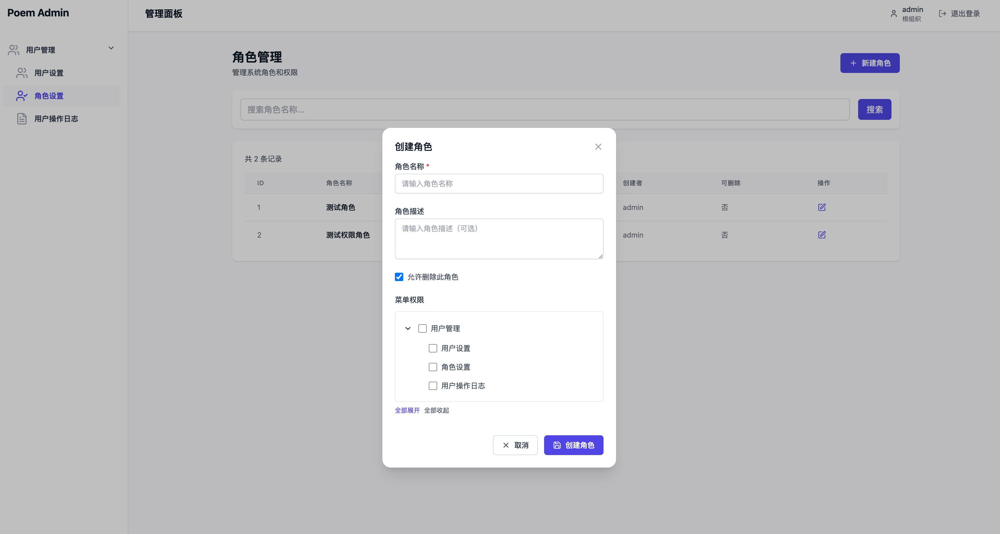

# poem admin

> 基于 Poem + Sqlx + Casbin 实现的后台管理系统

## 快速开始

```bash
git clone git@github.com:fan-tastic-z/poem-admin.git
```

启动数据库

```bash
chmod a+x ./scripts/init_db.sh
./scripts/init_db.sh
```

初始化数据库数据

```bash
cargo run --bin poem-admin init-data -c ./dev/config.toml
```

初始化超级管理员

```bash
 cargo run --bin poem-admin create-super-user -c ./dev/config.toml -p 12345678
```

启动服务

```bash
cargo run --bin poem-admin server -c ./dev/config/toml
```

### 前端

前端代码是通过 AI 生成

```bash
git clone git@github.com:fan-tastic-z/admin-web.git
```

启动前端服务

```bash
pnpm dev
```



